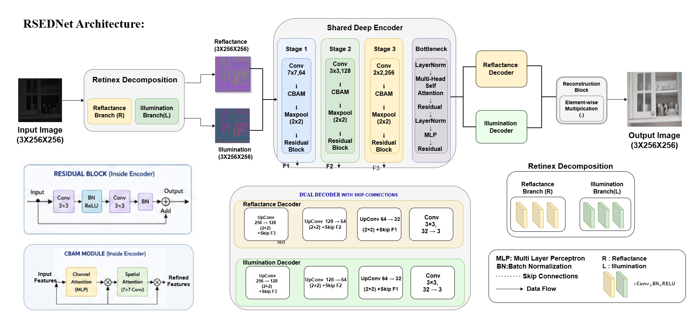

# ReSED-Net

Official implementation of **ReSED-Net: Residual Shared Encoder Dual Decoder Network for Low-Light Image Enhancement**.

## Overview

RSED-Net is a deep learning framework designed for low-light image enhancement. The network employs a shared encoder, dual decoder architecture, and CBAM attention modules to improve image brightness, contrast, and visual quality while preserving details.

## Architecture

## Features

* Shared Encoder Architecture
* Dual Decoder Design
* CBAM Attention Module
* TensorRT FP16 Deployment Support
* Real-Time Inference on NVIDIA Jetson Xavier

## Repository Structure

models/
training/
testing/
inference/
datasets/
checkpoints/
results/
paper/
tensorRT/

## Installation

pip install -r requirements.txt

## Training

python training/train.py

## Testing

python testing/test.py

## TensorRT Deployment

trtexec --onnx=RSEDNet.onnx \
         --saveEngine=RSEDNet_fp16.engine \
         --fp16

## Results

Experimental results and qualitative comparisons will be provided in the repository.

## Citation

If you use this work, please cite the corresponding paper.

@article{resednet2026,
  title={RSED-Net: Residual Shared Encoder Dual Decoder Network for Low-Light Image Enhancement},
  author={Maloth Vijaya, D Sai Nithin Sagar},
  year={2026}
}
